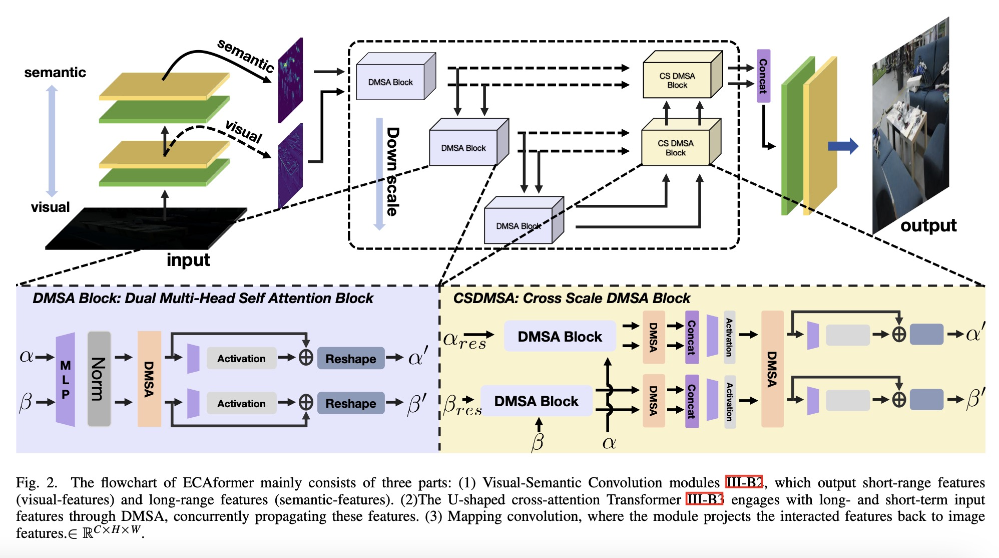
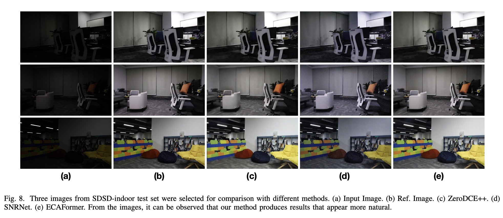
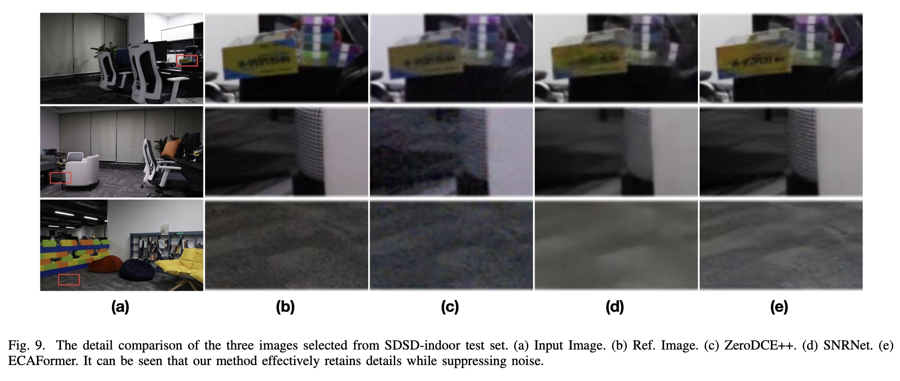
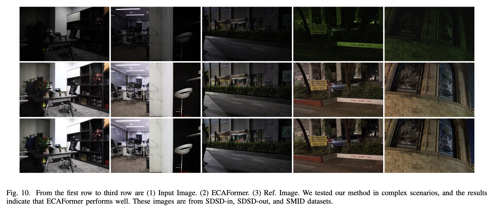
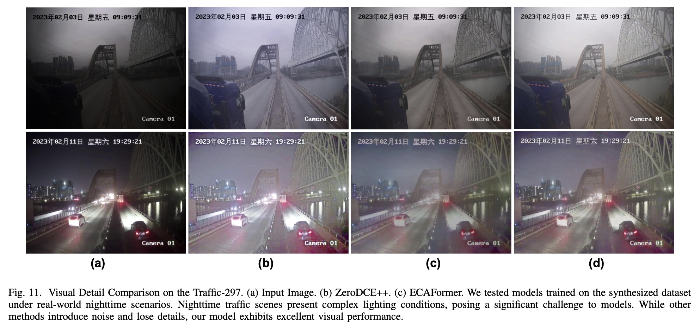

# Low-light Image Enhancement using Cross Attention
## 1. Model:

## 2. Traffic-297 Dataset
### Currently the training part of Traffic-297 dataset can be Download from [here](https://pan.baidu.com/s/1ypPd64G_xfkV4KsrwxmJIA?pwd=amk2). password:[amk2]
## 3. Model weights
| Dataset     | Checkpoints                                                      | results                                                          |
|-------------|------------------------------------------------------------------|------------------------------------------------------------------|
| LOL-v1      | [6rf7](https://pan.baidu.com/s/1kQRvbwKjbZxDfxJZOEKfrQ?pwd=6rf7) | [bqrb](https://pan.baidu.com/s/1KuiNQIINtIXOwB-OMjckHg?pwd=bqrb) |
| LOL-v2-r    | [vtqj](https://pan.baidu.com/s/18QrxzpD3mAOcybtQYAXlcQ?pwd=vtqj) | [eqmb](https://pan.baidu.com/s/1NRzIxL8bMt2cK1bJahqNgA?pwd=eqmb) |
| LOL-v2-s    | [ax7q](https://pan.baidu.com/s/1CvmJhv3epp8w_shehxXGwA?pwd=ax7q) | [5he3](https://pan.baidu.com/s/1uFWrxcNf3ru1kf15tXC8ow?pwd=5he3) |
| SID         | [hznl](https://pan.baidu.com/s/1FEAw6HA4Isrz8erIb08_6A?pwd=hznl) | [u4un](https://pan.baidu.com/s/1PG0nNollPaN5zvlMRlu-Jg?pwd=u4un) |
| SMID        | [ittd](https://pan.baidu.com/s/15HQQbq7axbyZVJDJleeJBw?pwd=ittd) | [h9wx](https://pan.baidu.com/s/1IqI3vKy7dPLV2S_wGVi4eQ?pwd=h9wx) |
| SDSD-in     | [71zq](https://pan.baidu.com/s/1fPixKSvnUKqgUxww-IP-lA?pwd=71zq) | [e5ms](https://pan.baidu.com/s/19qry8k8KXCRlOsd-cqzcWw?pwd=e5ms) |
| SDSD-out    | [7n3e](https://pan.baidu.com/s/1sK5kjSubwiGEBwn3YI0hNA?pwd=7n3e) | [bsed](https://pan.baidu.com/s/16LnLtWbGLVwX9sJo7V2Ifw?pwd=bsed) |
| Traffic-297 | [mspy](https://pan.baidu.com/s/1xvA4b6Zxe20Tqro7wySgMw?pwd=mspy)                                                             | [z2px](https://pan.baidu.com/s/1IGM39ycrBWVDkCbMLx0HHA?pwd=z2px)                                                             |
